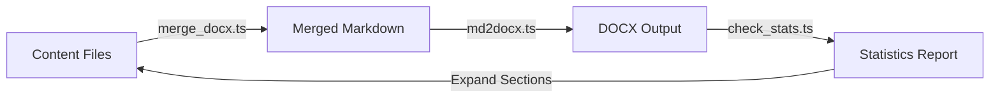

# LangDocx Skill - Scripts Directory

This directory contains TypeScript automation scripts for the long-form document generation workflow.

## Available Scripts

### 1. merge_docx.ts (or .template.ts)
**Purpose:** Recursively collect and merge content.md files into a single Markdown document.

**Features:**
- Hierarchical file collection with numeric sorting
- Automatic heading level adjustment based on directory depth
- YAML frontmatter injection for Pandoc
- Character count and page estimation

**Usage:**
```bash
# Customize TARGET_ROOTS configuration first
bun run merge_docx.ts
```

**Customization Points:**
- `TARGET_ROOTS`: Array of packages to process
- `WORDS_PER_PAGE`: Characters per page ratio (default 550)
- `getFiles()`: Modify to collect different file patterns

---

### 2. md2docx.ts (or .template.ts)
**Purpose:** Convert Markdown to DOCX using Pandoc with reference template.

**Features:**
- Markdown preprocessing (comment removal, numbering cleanup)
- Pandoc invocation with custom arguments
- Template-based style application
- Batch processing support

**Usage:**
```bash
# Single file
bun run md2docx.ts input.md output.docx

# Batch processing (requires merge_docx integration)
bun run md2docx.ts --all
```

**Customization Points:**
- `TEMPLATE_PATH`: Path to your template.docx
- `preprocessMarkdown()`: Custom Markdown transformations
- `convertAll()`: Uncomment and configure for batch processing

---

### 3. check_stats.ts (Optional - Project Specific)
**Purpose:** Generate PDF preview and analyze document statistics.

**Features:**
- Chrome headless PDF generation
- Page count extraction via pdfinfo
- Progress tracking against targets
- Expansion recommendations

**Dependencies:**
- Google Chrome or Chromium
- pdfinfo (poppler-utils)

**Usage:**
```bash
bun run check_stats.ts
```

**Note:** This script is highly project-specific and may need significant customization for your use case.

---

## Template Files

- `merge_docx.template.ts`: Clean template without project-specific paths
- `md2docx.template.ts`: Clean template without project-specific configuration

When setting up a new project:
1. Copy `.template.ts` files to remove `.template` suffix
2. Customize `TARGET_ROOTS` and paths
3. Adjust `WORDS_PER_PAGE` based on your content density

---

## Common Workflow



**Step-by-Step:**
1. Write content in `content.md` files across directories
2. Run `merge_docx.ts` to create unified Markdown
3. Run `md2docx.ts` to generate DOCX with template styling
4. (Optional) Run `check_stats.ts` to verify page count
5. Expand sections if needed and repeat

---

## Script Requirements

### Runtime
- **Bun** (>= 1.0): JavaScript/TypeScript runtime
  ```bash
  curl -fsSL https://bun.sh/install | bash
  ```

### External Tools
- **Pandoc** (>= 3.0): Document converter
  ```bash
  brew install pandoc  # macOS
  ```

- **xmllint** (optional): XML formatting
  ```bash
  brew install libxml2  # macOS
  ```

- **pdfinfo** (optional): PDF metadata extraction
  ```bash
  brew install poppler  # macOS
  ```

---

## Troubleshooting

### Issue: "Bun command not found"
**Solution:** Install Bun or use Node.js with minor modifications:
```bash
# Install Bun
curl -fsSL https://bun.sh/install | bash

# OR adapt for Node.js
npm install -g tsx
tsx merge_docx.ts
```

### Issue: "Pandoc not found"
**Solution:** Install Pandoc:
```bash
# macOS
brew install pandoc

# Ubuntu/Debian
sudo apt-get install pandoc

# Windows
choco install pandoc
```

### Issue: "Template file not found"
**Solution:** Ensure `assets/template.docx` exists:
```bash
ls ../assets/template.docx
# If missing, create template using STYLE_EXTRACTION_GUIDE.md
```

### Issue: Incorrect heading levels in output
**Cause:** Directory depth calculation mismatch.

**Solution:** Adjust the `depth` calculation in `merge_docx.ts`:
```typescript
// Current: depth = relPath.split("/").length - 2
// Try: depth = relPath.split("/").length - 1
const depth = Math.max(0, relPath.split("/").length - YOUR_OFFSET);
```

---

## Advanced Customization

### Custom File Patterns
Modify `getFiles()` to collect different files:
```typescript
// Collect all .md files (not just content.md)
} else if (dirent.name.endsWith(".md")) {
    files.push(res);
}
```

### Custom Markdown Extensions
Add preprocessing logic:
```typescript
function preprocessMarkdown(content: string): string {
    // ... existing preprocessing ...
    
    // Custom: Convert admonitions
    content = content.replace(
        /::: (warning|note|tip)\n([\s\S]*?)\n:::/g,
        (match, type, body) => `> **${type.toUpperCase()}**: ${body}`
    );
    
    return content;
}
```

### Multi-Language Support
Add language-specific processing:
```typescript
function adjustForLanguage(content: string, lang: "zh" | "en"): string {
    if (lang === "zh") {
        // Chinese: Use SimSun font
        return content;
    } else {
        // English: Use Arial font
        // Adjust template selection
        return content;
    }
}
```

---

## Script Architecture

### merge_docx.ts Flow
```
User Config (TARGET_ROOTS)
    ↓
getFiles() → Recursive directory scan
    ↓
Sort by numeric prefix
    ↓
Read content.md files
    ↓
Adjust heading levels (depth-based)
    ↓
Merge with YAML frontmatter
    ↓
Output: Package_Complete_Draft.md
```

### md2docx.ts Flow
```
Input: Markdown file
    ↓
preprocessMarkdown() → Clean content
    ↓
Pandoc command construction
    ↓
Bun.spawn(["pandoc", ...args])
    ↓
Error handling & validation
    ↓
Output: Styled DOCX file
```

---

## Performance Considerations

### Large Projects (>100 files)
- Consider parallelizing file reads:
  ```typescript
  const contents = await Promise.all(files.map(f => file(f).text()));
  ```

### Memory Usage
- For very large documents (>500 pages), process in chunks:
  ```typescript
  const CHUNK_SIZE = 50; // Files per chunk
  for (let i = 0; i < files.length; i += CHUNK_SIZE) {
      const chunk = files.slice(i, i + CHUNK_SIZE);
      // Process chunk...
  }
  ```

### Pandoc Performance
- Disable TOC for drafts to speed up conversion:
  ```typescript
  await convertMdToDocx(input, output, { toc: false });
  ```

---

## Testing Scripts

### Unit Test Example
```typescript
import { test, expect } from "bun:test";
import { countContentChars } from "./merge_docx";

test("countContentChars removes comments", () => {
    const input = "Text <!-- comment --> more text";
    expect(countContentChars(input)).toBe(12); // "Textmoretext"
});
```

### Integration Test
```bash
# Create test structure
mkdir -p test_project/01_Chapter
echo "# Test" > test_project/01_Chapter/content.md

# Run merge
bun run merge_docx.ts

# Verify output
test -f test_project/Test_Complete_Draft.md
```

---

## Maintenance

### Updating for New Projects
1. Copy `scripts/` folder to new project
2. Update `TARGET_ROOTS` in merge_docx.ts
3. Update `TEMPLATE_PATH` in md2docx.ts
4. Test with sample content before full run

### Version Control
```bash
# Track scripts
git add scripts/*.ts
git commit -m "Add document generation scripts"

# Ignore generated files
echo "*_Complete_Draft.md" >> .gitignore
echo "*.docx" >> .gitignore
```

---

## Further Reading

- See `../references/STYLE_EXTRACTION_GUIDE.md` for template creation
- See `../references/PROJECT_STRUCTURE_EXAMPLES.md` for directory patterns
- See `../SKILL.md` for complete workflow documentation
